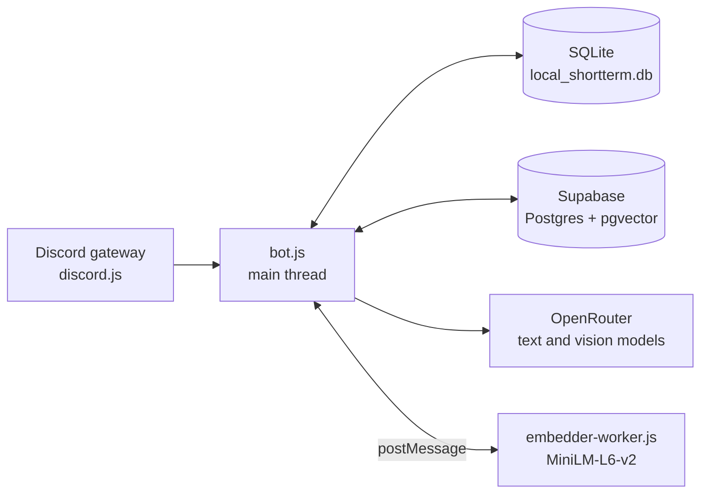

# Akari bot

A Discord bot with a persistent personality, long-term memory, evolving beliefs, and a sense of when to speak.

Akari doesn't answer every message like a command bot, and she doesn't only wake up when @mentioned. She follows the conversation, works out whether a message is meant for her, and replies with context: what she remembers about the people involved, what she believes about them, and how well she knows them.

---

«Development note: Akari was implemented and operational in July 2026. This README and the accompanying architecture documentation were written/documented afterward; the detailed architecture document was created in September 2026 to describe the already-existing system.»

---

## Features

- **Social awareness.** A small "social brain" model tracks conversation threads and decides who is expected to speak next. Akari replies unprompted only when it's genuinely her turn.
- **Layered memory.** Short-term history, expiring working memory, and semantic long-term memory that consolidates duplicates and fades over time.
- **Beliefs and goals.** Periodic reflection turns memories into beliefs about users, the server, and Akari herself. Beliefs strengthen, weaken, and decay gradually rather than resetting.
- **Rapport.** A slowly decaying per-user closeness score shapes her tone.
- **Vision.** Image attachments are described by a dedicated vision model, and durable facts from images can be remembered.
- **Local embeddings.** Semantic search runs on a local MiniLM model in a worker thread, so there are no embedding API calls and the Discord heartbeat is never blocked.
- **Graceful degradation.** Missing Supabase, a crashed embedder, or a failing model all fall back to simpler behavior instead of taking the bot down.
- **Built-in diagnostics.** `/stats` reports reply rates, latencies, retrieval quality, and fallback counts, so you can tune the constants against real usage.

## How it works



| Layer | Where | Purpose |
| --- | --- | --- |
| Local "brain" | SQLite (`node:sqlite`) | Raw history, working memory, conversation threads, private thoughts, diagnostics |
| Cloud "brain" | Supabase (Postgres + pgvector) | Long-term memories, beliefs, goals, user profiles, rapport |
| Language models | OpenRouter | Replies, reflection, social decisions, memory extraction, vision |
| Embeddings | Worker thread + Transformers.js | `Xenova/all-MiniLM-L6-v2`, 384-dimension vectors |

### Life of a message

1. Ignore bots, DMs, and any channel other than the configured one.
2. Describe attached images with the vision model (before taking the channel lock, since it can be slow).
3. Save the message to local history.
4. Decide whether to reply. An @mention always counts. Otherwise the social brain must say Akari is expected next with probability of at least 0.75.
5. Fetch memories, beliefs, goals, the speaker's profile, and rapport in parallel.
6. Generate the reply and send it (split at Discord's 2,000-character limit).
7. Save the reply, then run extraction and reflection in the background.

### Memory and reflection cadence

| Cadence | What happens |
| --- | --- |
| Every message | Save to history, decide whether to reply, retrieve context |
| Every ~10 messages | Extract long-term facts, working-memory items, and occasional private thoughts |
| Every ~150 messages, or after 3 quiet hours | Reflection: decay memories, update beliefs, goals, profiles, and rapport |
| Every ~1,200 messages | Major reflection: merge duplicate beliefs, self-reflection, drop stale goals |

Long-term memories are ranked when recalled:

```
score = 0.50 * similarity
      + 0.25 * importance
      + 0.15 * recency        (exp(-days since access / 20))
      + 0.10 * usefulness     (log of access count)
      + 0.08 if the memory is an event
      + 0.06 if it is about the current speaker
```

## Requirements

- **Node.js 22.13 or newer.** The bot uses the built-in `node:sqlite` module. Earlier 22.x releases need the `--experimental-sqlite` flag.
- A **Discord application and bot token** with the **Message Content** privileged intent enabled.
- An **[OpenRouter](https://openrouter.ai) API key.**
- *(Optional but recommended)* A **[Supabase](https://supabase.com) project** with the `vector` extension. Without it, Akari still chats and uses the social brain, but long-term memory, beliefs, goals, and reflection are disabled.

## Installation

```bash
git clone <your-repo-url>
cd <your-repo>
npm install
```

`bot.js` and `embedder-worker.js` must stay in the same folder, because the bot loads the worker by path.

### 1. Create the Discord bot

1. Open the [Discord Developer Portal](https://discord.com/developers/applications) and create an application.
2. Under **Bot**, create a bot user and copy its token.
3. Under **Bot → Privileged Gateway Intents**, enable **Message Content Intent**.
4. Under **OAuth2 → URL Generator**, select the `bot` and `applications.commands` scopes, then grant *View Channels*, *Send Messages*, and *Read Message History*. Open the generated URL to invite the bot.

### 2. Set up Supabase (optional)

1. In your Supabase project, enable the `vector` extension.
2. Run the schema SQL in [`schema.sql`](./schema.sql) to create the tables and functions below.
3. Copy your project URL and a service-role key.

The bot expects these database objects:

| Table | Holds |
| --- | --- |
| `long_term_memory` | Memories with a `vector(384)` embedding, importance, confidence, status, and access stats |
| `beliefs` | Scoped statements (`user`, `server`, `self`) with confidence and an embedding |
| `belief_evidence` | Links between beliefs and the memories that support them |
| `goals` | Akari's current goals, with priority and progress |
| `user_profiles` | One-paragraph profile per user per server |
| `relationship_state` | Rapport score and a short "current read" per user per server |

| Function | Purpose |
| --- | --- |
| `match_long_term_memory` | Nearest-neighbor search over memory embeddings |
| `find_similar_memory` | Find a near-duplicate memory to consolidate into |
| `reinforce_memories` | Bump access stats and revive fading memories |
| `decay_long_term_memory` | Move memories through active, fading, archived, forgotten |
| `belief_evidence_health` | Count how many supporting memories a belief still has |

### 3. Configure secrets

Credentials are read from environment variables, and a `.env` file in the project root is loaded automatically (via `dotenv`). Create one:

```env
DISCORD_TOKEN=your-discord-bot-token
OPENROUTER_KEY=your-openrouter-api-key
SUPABASE_URL=https://your-project.supabase.co
SUPABASE_KEY=your-supabase-service-role-key
```

`SUPABASE_URL` and `SUPABASE_KEY` are optional (see [Requirements](#requirements)). Start the bot from the project folder so `.env` is found, and never commit that file. It is listed in the suggested `.gitignore` below.

### 4. Check the model names

Model slugs are constants at the top of `bot.js`. OpenRouter's free-model catalog changes often, so confirm each one at [openrouter.ai/models](https://openrouter.ai/models) before you run.

| Constant | Used for |
| --- | --- |
| `PRIMARY_MODEL` | Replies, reflection, major reflection |
| `FALLBACK_MODEL` | Automatic retry when any other text call fails |
| `SOCIAL_MODEL` | Social brain, memory extraction, memory merging |
| `PRIMARY_VISION_MODEL` | Describing image attachments |
| `FALLBACK_VISION_MODEL` | Second attempt if the primary vision call fails |

### 5. Run it

```bash
npm start
```

For development, `npm run dev` restarts the bot automatically when files change.

You should see `Akari 9.0 Cognitive Engine online as <bot tag>` once she connects, and `MiniLM-L6-v2 initialized successfully` once the embedding worker is ready. The first start downloads the embedding model, so it needs network access and takes a little longer.

Then, in your server, run `/setup` and choose the channel where Akari should live.

## Commands

All commands require the **Manage Server** permission and reply ephemerally.

| Command | Description |
| --- | --- |
| `/setup channel:#channel` | Sets the one channel where Akari is active in this server |
| `/disable` | Removes this server's configuration, so Akari goes silent |
| `/stats` | Shows a diagnostics report |

`/stats` includes reply rate (mentions versus thread-based), average reply latency, memories returned per reply, zero-result and consolidation rates, extraction and reflection parse-failure rates, model and vision fallback counts, and live Supabase counts of memories, beliefs, and goals.

## Tuning

Every tunable is a constant at the top of `bot.js`. The most useful ones:

| Constant | Default | Effect |
| --- | --- | --- |
| `REPLY_PROBABILITY_THRESHOLD` | `0.75` | Higher makes Akari quieter, lower makes her chattier |
| `SOCIAL_BRAIN_MIN_INTERVAL_MS` | `3000` | Minimum gap between social-brain calls per channel |
| `SHORT_TERM_TOKEN_BUDGET` | `9000` | Estimated tokens of chat history sent to the model |
| `EXTRACTION_INTERVAL` | `10` | Messages between memory extractions |
| `REFLECTION_MESSAGE_INTERVAL` | `150` | Messages between reflections |
| `MAJOR_REFLECTION_MESSAGE_INTERVAL` | `1200` | Messages between major reflections |
| `MEMORY_MAX_RETURN` | `8` | Memories placed in each prompt |
| `CONSOLIDATION_SIMILARITY_THRESHOLD` | `0.86` | Similarity at which two memories merge |
| `BELIEF_LEARNING_RATE` | `0.18` | How quickly reinforcement raises belief confidence |
| `RAPPORT_DECAY_HALFLIFE_DAYS` | `10` | How fast closeness fades without contact |
| `HISTORY_RETENTION_DAYS` | `30` | How long raw messages are kept locally |

## Data and privacy

- Raw messages are kept in `local_shortterm.db` for 30 days, then purged.
- Long-term memories, beliefs, goals, profiles, and rapport live in your Supabase project and persist until they decay or are pruned.
- Messages are sent to OpenRouter (and the model providers behind it) to generate replies. Only the configured channel is read.
- Long-term memory retrieval is per server, not per person, so a memory about one user can surface in a conversation with another when it's relevant. Beliefs, profiles, and rapport are only used when the person they concern is the one speaking.
- Let your server members know that Akari remembers things.

## Project structure

```
.
├── bot.js                 # Main process: Discord client, memory, reflection, social brain
├── embedder-worker.js     # Worker thread running the MiniLM embedder
├── schema.sql             # Supabase tables and functions
├── package.json
├── package-lock.json
├── .env                   # Your secrets (git-ignored, you create this)
└── local_shortterm.db     # Created on first run (git-ignored)
```

A suggested `.gitignore`:

```
node_modules/
.env
local_shortterm.db
local_shortterm.db-*
```

## Troubleshooting

| Symptom | Likely cause |
| --- | --- |
| `An invalid token was provided` on start | `.env` is missing, misnamed, or you started the bot from a different folder. Check `DISCORD_TOKEN` |
| Bot is online but never replies | Message Content intent is off, `/setup` hasn't been run, or the channel doesn't match |
| Replies to @mentions but never joins conversations | The social model is failing, or `REPLY_PROBABILITY_THRESHOLD` is too high. Check `/stats` |
| `ExperimentalWarning: SQLite` in the console | Expected on current Node versions. It is harmless |
| `No such built-in module: node:sqlite` | Node.js is too old. Upgrade to 22.13 or newer |
| `[Embedder] ... failed` on start | Model download failed or the network is blocked. The bot keeps running without semantic memory |
| `[Startup Warning] SUPABASE_URL/SUPABASE_KEY not set` | Supabase is optional, but long-term memory and reflection stay disabled without it |
| Model errors or empty replies | An OpenRouter slug may have been retired. Verify the model constants |

## License

Released under the [MIT License](./LICENSE).

## Built with

[discord.js](https://discord.js.org), [OpenRouter](https://openrouter.ai), [Supabase](https://supabase.com) with [pgvector](https://github.com/pgvector/pgvector), [Transformers.js](https://huggingface.co/docs/transformers.js), and Node.js's built-in `node:sqlite` and `worker_threads`.
